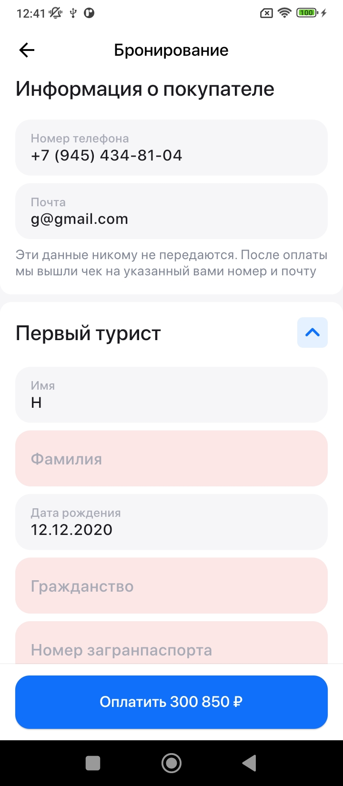

### Используемые технологии
* State Management - Bloc(Cubit)
* Связь с бэкендом - Retrofit
* Навигация - go_router
* DI - get_it

### Скриншоты

[Ссылка на демонстрацию работы](https://drive.google.com/file/d/1ucykESPkp6RL8H8eEVO4ui_GsWXSMeoe/view?usp=sharing)

##### Экран "Отель"

##### Экран "Номер"

##### Экран "Бронирование"

##### Экран "Оплачено"

